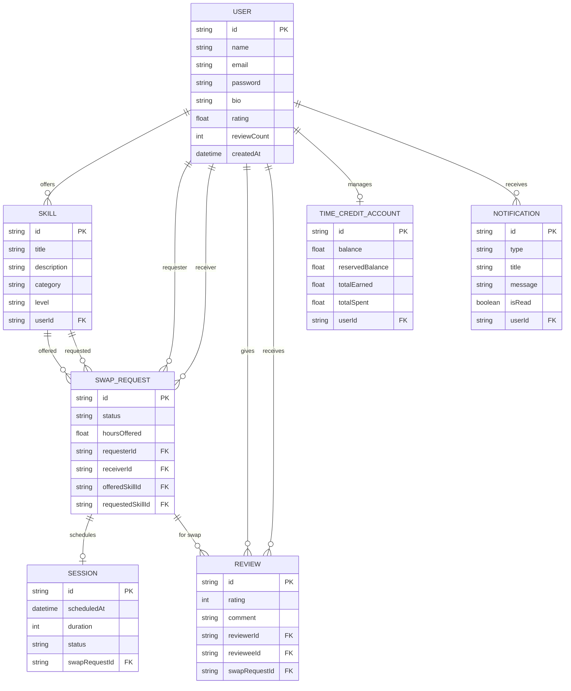

# ER Diagram - SkillBarter

The ER Diagram defines the database structure for the SkillBarter system.

## Description
- **One-to-One**: Users have a single `TimeCreditAccount`.
- **One-to-Many**: Users can have multiple `Skill` offers, `SwapRequest` logs, and `Notification` items.
- **Many-to-One**: `SwapRequest` links two users and two skills together.