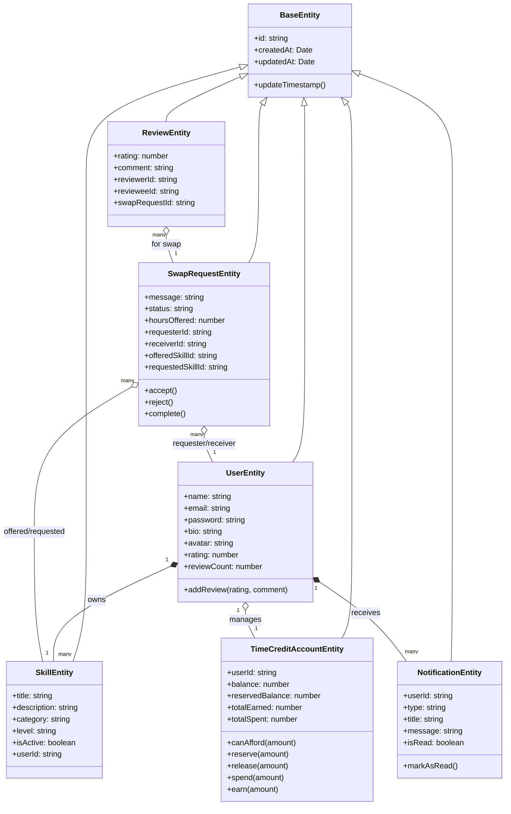

# Class Diagram - SkillBarter

The Class Diagram illustrates the domain-driven design and layered architecture.

## Description
- **Domain Focus**: Each entity contains business-oriented logic (e.g., `reserveCredits`, `addReview`).
- **Clean Architecture**: Repositories interact with these entities to ensure decoupled data management.
- **Inheritance**: `BaseEntity` provides common metadata fields and update mechanisms.
