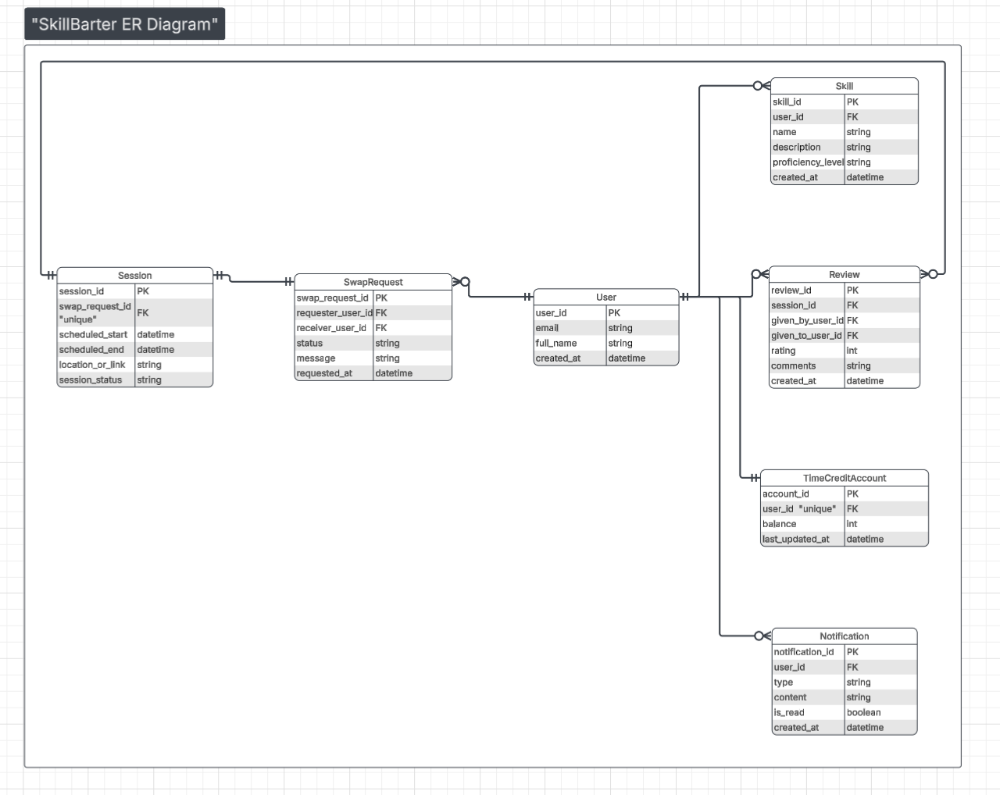

# ER Diagram – SkillBarter System

## Overview
The ER diagram represents the database structure of the SkillBarter system.  
It defines the entities, their attributes, and the relationships between them.

## Entities
- User
- Skill
- SwapRequest
- Session
- Review
- TimeCreditAccount
- Notification

## Key Relationships
- One user can own multiple skills.
- A swap request is created between two users.
- Each swap request has exactly one session.
- Users can give and receive multiple reviews.
- Each user has one time credit account.
- A user can receive multiple notifications.