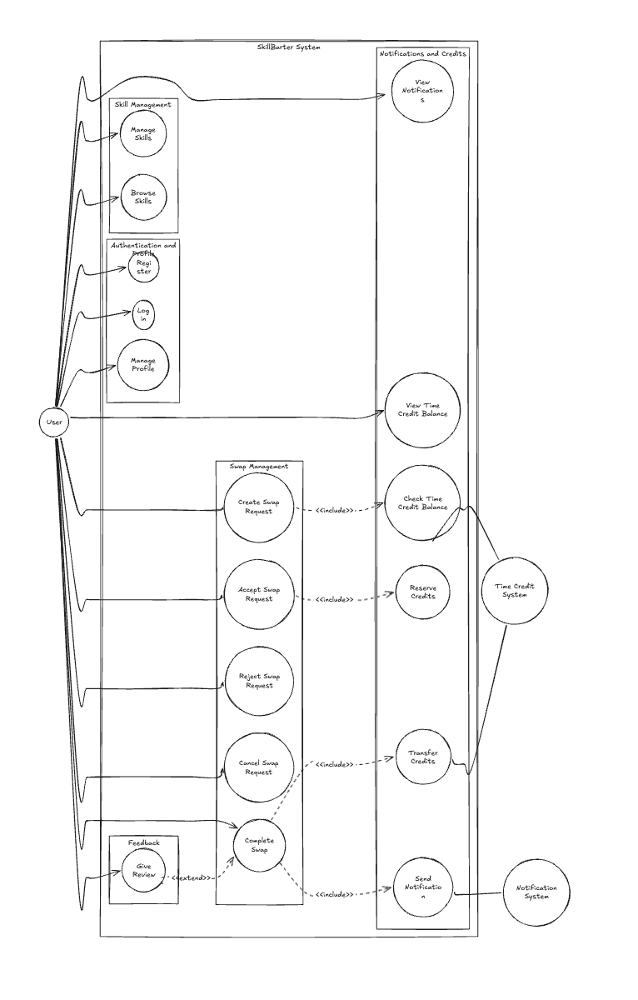

# Use Case Diagram – SkillBarter System

## Use Cases

### Authentication & Profile
- Register, Login, Manage Profile

### Skill Management
- Manage Skills, Browse Skills

### Swap Management
- Create Swap Request, Accept Swap Request, Reject Swap Request, Cancel Swap Request, Complete Swap

### Credits & Notifications
- View Time Credit Balance, Check Time Credit Balance, Reserve Credits, Transfer Credits, Send Notification

### Feedback
- Give Review

## Relationships

### <<include>> (Mandatory)
- Create Swap Request → Check Time Credit Balance
- Accept Swap Request → Reserve Credits
- Complete Swap → Transfer Credits
- Complete Swap → Send Notification

### <<extend>> (Optional)
- Give Review → Complete Swap

