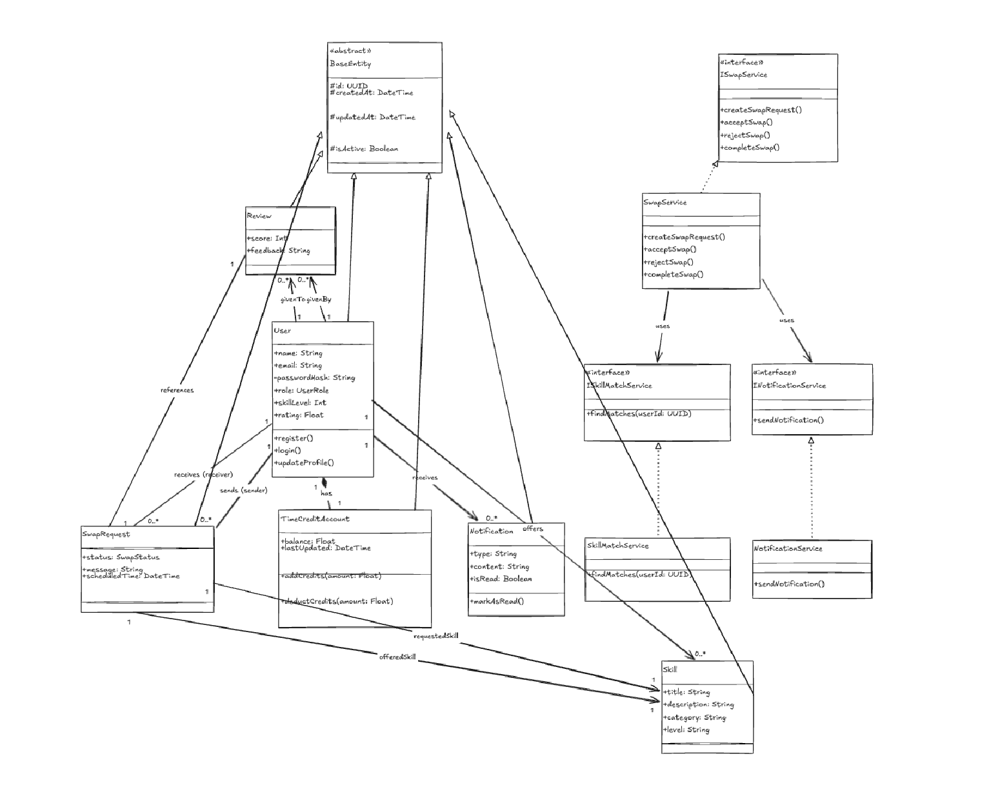

# UML Class Diagram

## Overview
This document contains the UML class diagram for the SkillBarter application.

## Description

The UML class diagram represents the domain model and layered architecture of the **SkillBarter – Skill Swap Marketplace** backend.

All core entities inherit from the abstract `BaseEntity`, which provides common fields: `id`, `createdAt`, and `updatedAt`.

### Main Domain Entities

- **User** – manages profile information and ratings
- **Skill** – represents skills offered by users
- **SwapRequest** – handles the skill exchange workflow
- **Review** – stores feedback between users
- **TimeCreditAccount** – tracks time-based credits for skill exchange

### Architecture

The system follows **Clean Architecture**:
- **Controllers** handle incoming requests
- **Services** contain business logic
- **Repositories** manage data access

### Key Relationships

- Inheritance from `BaseEntity`
- Composition between `SwapRequest`
- Aggregation between `User` and `Skill`

This structure promotes scalability, maintainability, and testability.

