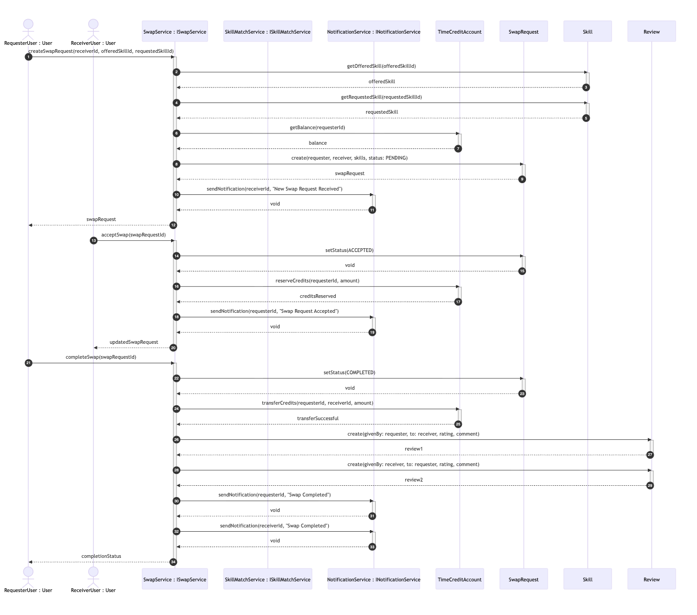
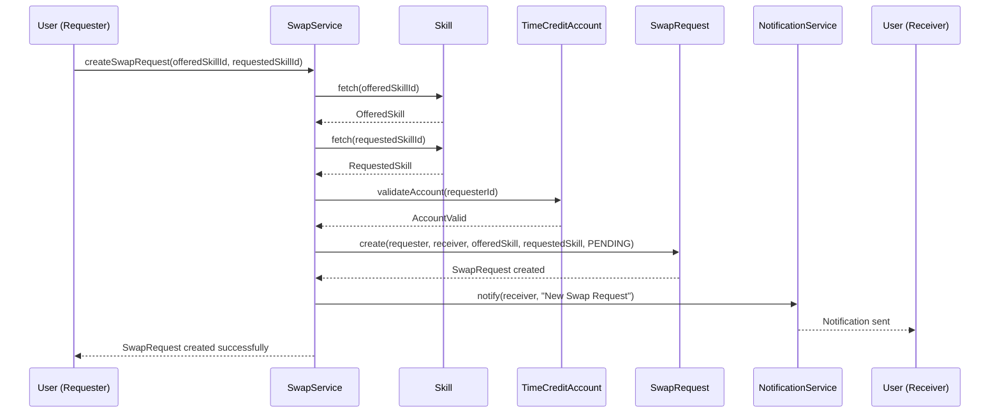
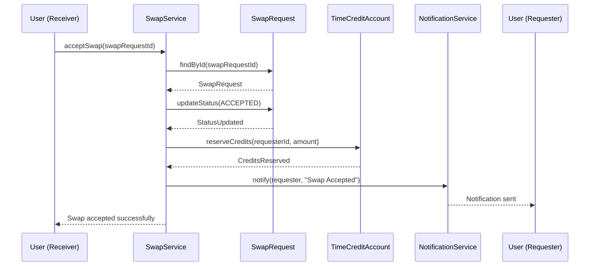
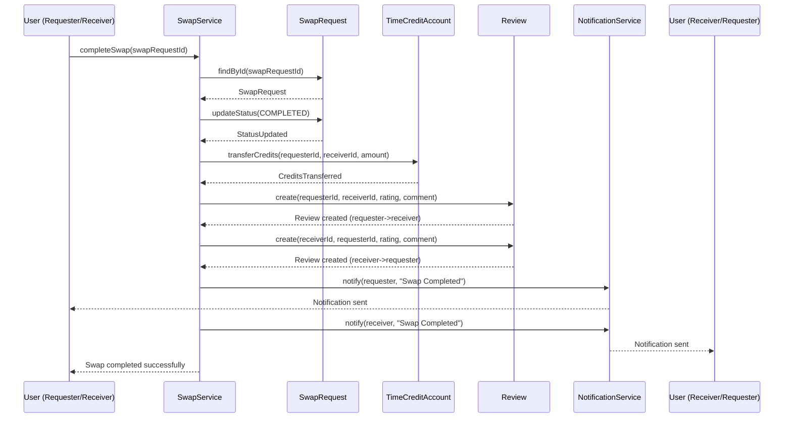

# Sequence Diagrams

This document describes the sequence diagrams for the SkillBarter – Skill Swap Marketplace backend.

The diagrams illustrate how different domain objects and services interact to complete the main workflows of the system.
They are derived directly from the UML class diagram and reflect the actual business logic.

---

---

## 1️⃣ Create Swap Request

**Overview**

This sequence shows how a user creates a swap request to exchange a skill with another user.

**Flow**

1. The requester initiates `createSwapRequest()` on SwapService.
2. The service fetches:
   - offered skill
   - requested skill
3. The requester's TimeCreditAccount is validated.
4. A new SwapRequest is created with PENDING status.
5. NotificationService notifies the receiver.

**Diagram**

---

## 2️⃣ Accept Swap Request

**Overview**

This sequence shows how the receiver accepts a swap request.

**Flow**

1. The receiver calls `acceptSwap()` on SwapService.
2. The SwapRequest status is updated to ACCEPTED.
3. Time credits are reserved from the requester.
4. A notification is sent to the requester.

**Diagram**

---

## 3️⃣ Complete Swap & Add Review

**Overview**

This sequence represents the completion of a swap session and the exchange of time credits and reviews.

**Flow**

1. A user calls `completeSwap()` on SwapService.
2. The SwapRequest status becomes COMPLETED.
3. Time credits are transferred between both users.
4. Two Review objects are created:
   - requester → receiver
   - receiver → requester
5. Notifications are sent to both users.

**Diagram**

---

## Summary

| Workflow | Trigger | Key Actions | Result |
|----------|---------|-------------|--------|
| Create Swap Request | User initiates swap | Validate account, create request, notify receiver | PENDING SwapRequest |
| Accept Swap Request | Receiver accepts | Update status, reserve credits, notify requester | ACCEPTED SwapRequest |
| Complete Swap | User completes session | Transfer credits, create reviews, notify both | COMPLETED SwapRequest |

