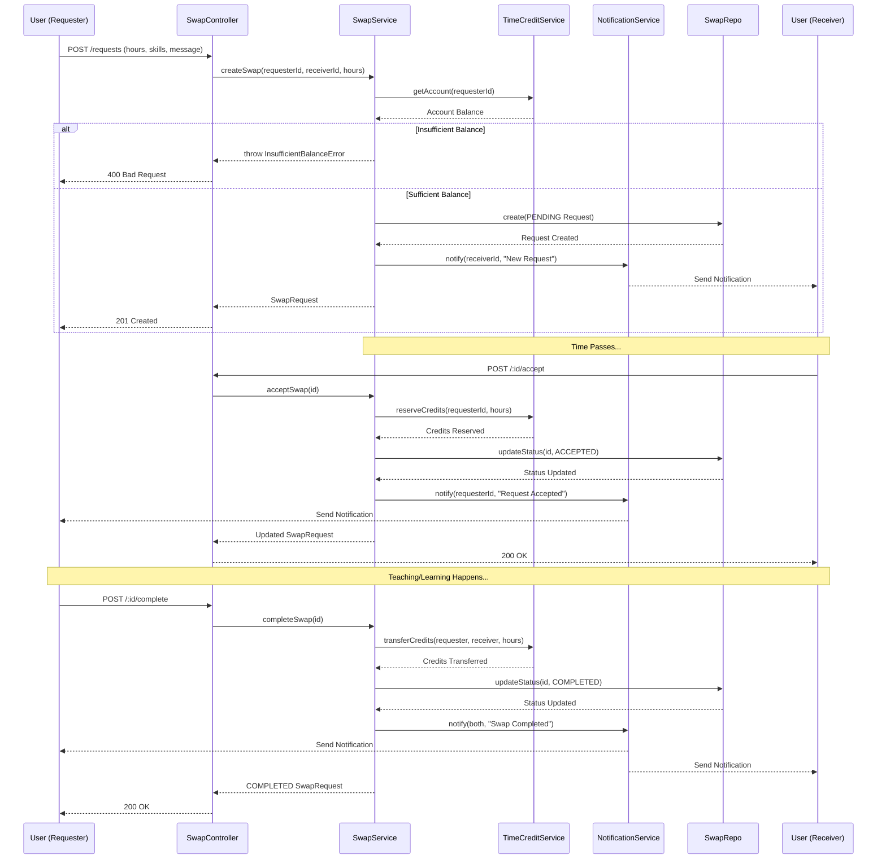

# Sequence Diagram - SkillBarter

The Sequence Diagram illustrates the interactions between different domain objects during the skill swap lifecycle.

## Main Flow: Swap Request & Completion

```mermaid
sequenceDiagram
    participant U as User (Requester)
    participant C as SwapController
    participant S as SwapService
    participant TCR as TimeCreditService
    participant NS as NotificationService
    participant SR as SwapRepo
    participant R as User (Receiver)

    U->>C: POST /requests (hours, skills, message)
    C->>S: createSwap(requesterId, receiverId, hours)
    S->>TCR: getAccount(requesterId)
    TCR-->>S: Account Balance
    alt Insufficient Balance
        S-->>C: throw InsufficientBalanceError
        C-->>U: 400 Bad Request
    else Sufficient Balance
        S->>SR: create(PENDING Request)
        SR-->>S: Request Created
        S->>NS: notify(receiverId, "New Request")
        NS-->>R: Send Notification
        S-->>C: SwapRequest
        C-->>U: 201 Created
    end

    Note over R,S: Time Passes...

    R->>C: POST /:id/accept
    C->>S: acceptSwap(id)
    S->>TCR: reserveCredits(requesterId, hours)
    TCR-->>S: Credits Reserved
    S->>SR: updateStatus(id, ACCEPTED)
    SR-->>S: Status Updated
    S->>NS: notify(requesterId, "Request Accepted")
    NS-->>U: Send Notification
    S-->>C: Updated SwapRequest
    C-->>R: 200 OK

    Note over U,R: Teaching/Learning Happens...

    U->>C: POST /:id/complete
    C->>S: completeSwap(id)
    S->>TCR: transferCredits(requester, receiver, hours)
    TCR-->>S: Credits Transferred
    S->>SR: updateStatus(id, COMPLETED)
    SR-->>S: Status Updated
    S->>NS: notify(both, "Swap Completed")
    NS-->>U: Send Notification
    NS-->>R: Send Notification
    S-->>C: COMPLETED SwapRequest
    C-->>U: 200 OK
```

## Key Interactions
- **Reservation**: Credits are reserved upon acceptance to ensure "payment" safety.
- **Transfer**: Credits are moved from reserved to the receiver's balance upon completion.
- **Notifications**: Automated messages sent at each significant state change.
